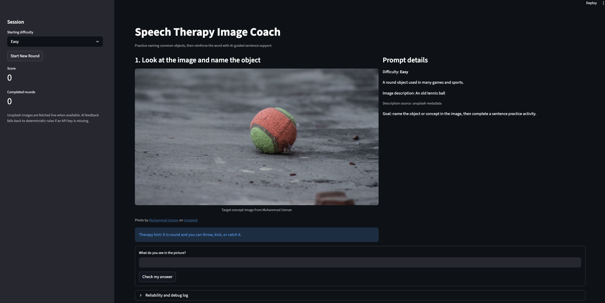
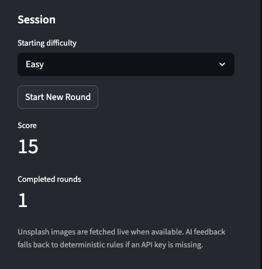
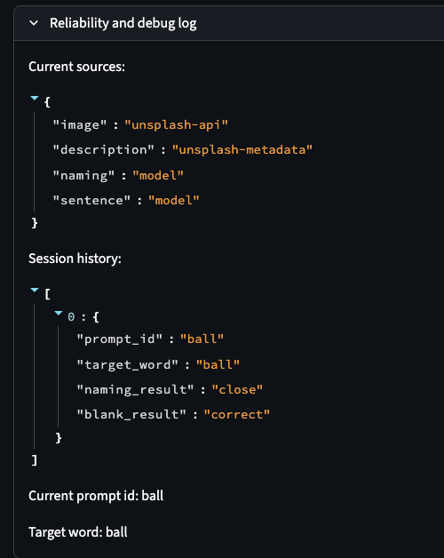

# Speech Therapy Image Coach

This project extends my original Module 1-3 base project, `ai110-module1show-gameglitchinvestigator-starter`, which began as a Streamlit number guessing game focused on debugging broken AI-generated code. The original project helped users practice spotting logic bugs, state issues, and testing problems in a simple interactive app. This final version repurposes that session-based app structure into an AI-supported speech-therapy learning tool.

## Project Summary

Speech Therapy Image Coach helps a learner practice naming common objects from images and then reinforces the word with a fill-in-the-blank sentence activity. The app uses curated therapy-friendly prompts, live Unsplash image support, structured AI feedback, and deterministic guardrails so the system still works when an API key is unavailable.


Caption: Main app screen showing the image prompt, prompt details, naming input, and session sidebar.

## Architecture Overview

The app follows a small multi-step AI workflow:

1. A curated prompt is selected based on difficulty.
2. The app fetches an Unsplash image or falls back to a predictable image source.
3. The learner names the object shown in the image.
4. A guarded evaluation step checks the answer and provides supportive coaching.
5. The app generates a sentence practice activity and validates the blank answer.
6. Progress, score, confidence, and reliability logs are stored in session history.

See [assets/system_architecture.svg](assets/system_architecture.svg) for the diagram.

## Setup Instructions

1. Install dependencies:

```bash
python3 -m pip install -r requirements.txt
```

2. Create a local `.env` file from the example template:

```bash
cp .env.example .env
```

3. Open `.env` and add your own keys:

```bash
LLM_PROVIDER=auto
GEMINI_API_KEY=your_gemini_key
GEMINI_MODEL=gemini-2.0-flash
OPENAI_API_KEY=your_api_key
OPENAI_MODEL=gpt-4o-mini
UNSPLASH_ACCESS_KEY=your_unsplash_key
```

`LLM_PROVIDER=auto` will use Gemini first if `GEMINI_API_KEY` is present, otherwise OpenAI if `OPENAI_API_KEY` is present, otherwise the app falls back to deterministic local behavior.

If you do not add keys, the app still runs with fallback behavior.

4. Run the app:

```bash
python3 -m streamlit run app.py
```

5. Run tests:

```bash
python3 -m pytest
```

6. Run the reliability script:

```bash
python3 evaluation.py
```

## Sample Interactions


Caption: Example interaction showing the session sidebar after a completed round.

### Example 1
- Image prompt: apple
- User response: `apple`
- AI feedback: `Nice work. You correctly identified the apple.`
- Sentence activity: `I eat an _____ for a healthy snack.`
- User blank answer: `apple`

### Example 2
- Image prompt: bicycle
- User response: `bike`
- AI feedback: `That is close. Think about the exact therapy word: bicycle.`
- Sentence activity: `He rides his _____ to the park after school.`
- User blank answer: `bicycle`

### Example 3
- Image prompt: chair
- User response: `table`
- AI feedback: `Not quite yet. Try again and use the image plus the hint if needed.`
- Follow-up: user uses the hint and retries

## Design Decisions

- I kept Streamlit and session state from the original project so I could build on a working UI pattern.
- I used a curated prompt list instead of free-form image search so the demo stays reproducible and classroom-safe.
- I added optional API integrations, but the main workflow still runs with deterministic fallback logic. That decision makes the project easier to demo and test.
- The app supports either Gemini or OpenAI for the AI text steps, which makes local setup more flexible.
- I used image naming as the core task and sentence completion as the reinforcement task to keep the scope manageable while still showing multiple AI-assisted steps.
- I used a local `.env` file pattern so API keys can be used during development without being committed to GitHub.

## Testing Summary

- `pytest` covers answer matching, blank-sentence generation, scoring, difficulty adjustment, and fallback sentence behavior.
- `evaluation.py` runs a small predefined reliability harness across exact matches, synonym cases, and incorrect responses.
- The app also logs prompt ids, result status, and model vs fallback sources inside the debug panel so it is easier to inspect failures.
- If the model returns malformed structured fields, such as a text confidence label instead of a numeric value, the app falls back to deterministic values instead of crashing.


Caption: Reliability and debug log showing that the image came from Unsplash and the naming/sentence steps used the model path.

## What Worked And What Did Not

- The deterministic guardrails kept the project stable and helped prevent the model from returning unusable labels.
- One important guardrail is the confidence fallback: if a model returns a value like `"high"` instead of `0.85`, the app now uses the deterministic confidence score safely.
- The image prompt plus sentence-support flow makes the app feel more helpful than a single-answer checker.
- A limitation is that typed text stands in for spoken therapy interaction, so it does not measure pronunciation or articulation directly.

## Reflection

This project taught me that a useful AI system is not just about calling a model. It also needs reliable inputs, guardrails, fallback behavior, and testing. Building on my earlier debugging project helped me think more clearly about how AI-generated outputs should be checked before they reach a user.

## Loom Walkthrough

Add your Loom walkthrough link here before submission:

`<div style="position: relative; padding-bottom: 62.5%; height: 0;"><iframe src="https://www.loom.com/embed/d01124195f684860805798821234b0e6" frameborder="0" webkitallowfullscreen mozallowfullscreen allowfullscreen style="position: absolute; top: 0; left: 0; width: 100%; height: 100%;"></iframe></div>`
